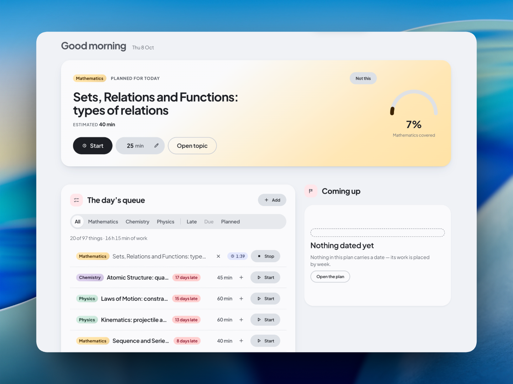

<p align="center">
  <a href="https://github.com/avinaxhroy/SAM">
    
  </a>
</p>

<h1 align="center">SAM</h1>

<p align="center">
  
</p>

<p align="center">
  A configurable, local-first study OS for desktop and terminal.
</p>

<p align="center">
  <a href="https://github.com/avinaxhroy/SAM/releases">
    
  </a>
</p>

Most study tools enforce one rigid workflow: to-do lists that know nothing about course prerequisites, flashcard apps disconnected from syllabi, or opinionated dashboard apps that assume everyone studies the same way.

Real studying differs across disciplines. A medical student drilling anatomy flashcards does not work like an engineering student working through problem sets, and a university student managing weekly lecture milestones does not work like an autodidact reading through technical books.

SAM is built as an operating system rather than a fixed dashboard. It stores your curriculum as plain JSON and line-delimited records on disk, lets you assemble custom screens with a drag-and-drop widget composer, and lets you choose how progress is measured for each subject.

---

## Getting started

### Prebuilt releases

Download prebuilt binaries for macOS, Windows, and Linux from [GitHub Releases](https://github.com/avinaxhroy/SAM/releases).

#### macOS installation

Install via Homebrew:

```bash
brew install --cask avinaxhroy/tap/sam
```

Or download the DMG directly. Because releases are not code-signed yet, strip the quarantine flag if Gatekeeper blocks launch:

```bash
# If the downloaded DMG will not open:
xattr -d com.apple.quarantine ~/Downloads/SAM_*.dmg

# Or strip the flag after dragging SAM to /Applications:
xattr -cr /Applications/SAM.app
```

#### Windows and Linux

Download the installer or `.AppImage` / `.deb` from the releases page and launch it directly.

### Building from source

Prerequisites:

- Rust 1.80 or newer (2024 edition)
- Node.js v20 or newer, with pnpm v9 or newer
- Linux only: `libwebkit2gtk-4.1-dev` headers

```bash
# 1. Install frontend dependencies and build assets
pnpm -C ui install
pnpm -C ui build

# 2. Build workspace binaries
cargo build --workspace --release

# 3. Launch the desktop app
cargo tauri dev

# 4. Or run the headless CLI
./target/release/sam help
```

On first launch without an existing plan, SAM opens a starter screen to select a preset or create a blank plan folder.

---

## Screen Composer

Every screen in the desktop app can be modified or built from scratch using the Screen Composer.

Click the pencil icon in the titlebar (or create a new screen from the sidebar) to enter edit mode:

- **12 built-in widgets**: Focus card, daily queue, course list, plan spine, practice problem bank, review queue, recall card, seven-day chart, upcoming dates, weekly progress figures, mock exam calendar, and reference library.
- **Grid widths**: Toggle any widget between half-width (`span: 1`) and full-width (`span: 2`).
- **Inline design variants**: Cycle component styles with the `‹` and `›` chevrons directly on the widget frame.
- **Reordering and deletion**: Drag widgets into position. Deletions show an undo toast receipt.
- **One-click reset**: Revert any preset screen back to its default layout at any time.

Screen layouts persist to `content/views.json` through atomic file transactions. Every layout change supports undo (`⌘Z` or `Ctrl+Z`).

---

## Pluggable study methods

How you complete work is defined by progression pipelines in `content/rules.json`. Different entity types can use different completion rules:

- `check`: Simple done or not-done state. Suitable for reading lists, lectures, and task outlines.
- `pages`: Page tracking for books and articles (`reading` → `read`).
- `progress`: Multi-step coursework and projects (`started` → `midway` → `done`).
- `flip`: Lecture and proof workflow (`learned` → `proved` → `anchored`). Topics require target numbers of solved problems before unlocking the proved stage.
- `srs`: Spaced repetition (`new` → `learning` → `review` → `mature`), driven by recall ratings.

Switch an entity's pipeline at any time without losing historical progress:

```bash
sam type.setPipeline topic --pipeline check --map learned=done --map proved=done --plan ./my-plan
```

### Review schedulers

When an item enters a review queue, next intervals calculate through your chosen scheduler in `rules.json`:

- **FSRS-6**: Embedded Rust implementation of the Free Spaced Repetition Scheduler, using 21 configurable weights to model memory stability and retrievability.
- **SuperMemo-2 (`sm2`)**: Traditional ease factor and repetition intervals.
- **Fixed ladders (`fixed`)**: Explicit day intervals (by default, `[1, 7, 30]` days).

---

## Four interaction surfaces

Every engine capability is accessible across four surfaces:

| Surface      | Interface       | How to use it                                                                         |
| ------------ | --------------- | ------------------------------------------------------------------------------------- |
| **Click**    | Desktop app     | Graphical controls, tables, boards, and timers in Svelte 5.                           |
| **Name**     | Command palette | Press `⌘K` (or `Ctrl+K`) to search screens, run commands, or use quick capture (`a`). |
| **Text**     | File system     | Edit JSON and `.jsonl` files in your editor; the watcher reloads within ~150ms.       |
| **Terminal** | Headless CLI    | Run `sam <command-id>` for scripting and automation.                                  |

---

## Plan structure on disk

A study plan is a standard directory on your computer:

```
my-plan/
├── content/
│   ├── types.json          # Entity schemas (course, topic, session, problemset)
│   ├── views.json          # Screen layouts, block arrangements, and composer widgets
│   ├── rules.json          # Schedulers, progression pipelines, and proof gates
│   ├── shell.json          # Navigation destinations and icons
│   ├── appearance.json     # Pinned theme and font scaling
│   └── records/
│       ├── course.jsonl    # Line-by-line course records
│       ├── topic.jsonl     # Syllabus topics with estimates and links
│       └── session.jsonl   # Logged study sessions
├── state/
│   └── state.json          # Review history, timestamps, and recall stability
└── index.sqlite            # Read-only SQLite search cache (auto-generated)
```

Records are stored as line-delimited JSON (`.jsonl`). Each line is a self-contained record, producing clean Git diffs.

Plans live by default in your platform application data directory:

- **macOS**: `~/Library/Application Support/SAM/plans/<Plan Name>`
- **Linux**: `~/.local/share/SAM/plans/<Plan Name>`
- **Windows**: `%APPDATA%\SAM\plans\<Plan Name>`

Target any custom directory with `--plan <path>`.

---

## Bundled presets

SAM includes 8 curriculum starters:

- `blank`: Empty schema ready for custom entity definitions.
- `university-term`: Traditional semester with courses, units, topics, weekly schedules, and credits.
- `self-study`: Milestone-oriented plan for independent courses, books, and practical projects.
- `jee`: High-volume problem practice across Physics, Chemistry, and Mathematics with accuracy metrics.
- `neet`: High-retention medical entrance syllabus covering Biology, Chemistry, and Physics paired with FSRS.
- `cbse11-pcm`: Class 11 secondary curriculum mapped to standard textbook chapters.
- `language`: Vocabulary acquisition, grammar rules, reading logs, and listening practice.
- `seed`: Reference starter with sample records used for engine tests.

Create a plan from any preset:

```bash
sam plan.new --name "Computer Systems" --preset university-term --plan ./my-plan
```

See [`docs/presets.md`](docs/presets.md) for customization guides.

---

## Command-line interface

Every graphical action maps to a command ID in the headless `sam` binary:

```bash
# Inspect the current plan and today's queue
sam today.view --plan ./my-plan
sam paths --plan ./my-plan --json

# Add a topic and advance it past a proof gate
sam topic.new --title "Graph Traversal" --kind practice --est 45 --course c.cs.dsa --plan ./my-plan
sam record.advanceStage --id topic.r1 --stage proved --problems 2 --plan ./my-plan

# Log a review rating (calculates next due date)
sam record.logReview --id topic.r1 --rating good --plan ./my-plan

# Apply batch updates or validate configuration
sam apply updates.jsonl --plan ./my-plan
sam configcheck --plan ./my-plan
```

Standard exit codes signal status: `0` (success), `1` (validation or proof gate error), `2` (usage), `3` (concurrency conflict), `4` (I/O error).

See [`docs/cli.md`](docs/cli.md) for batch transactions via stdin and optimistic concurrency options.

---

## Authoring study plans with AI

SAM exposes schema introspection and atomic batch ingestion via the CLI, so you can populate plans with AI coding agents or standard chatbots without special plugins.

### 1. With an AI coding agent (Claude Code, Cursor, Windsurf, OpenHands, Antigravity)

Paste this prompt into your agent's chat or terminal:

```text
Create a study plan for [my learning goal or syllabus] in ./my-plan using SAM. Follow the workflow in https://github.com/avinaxhroy/SAM/blob/main/docs/ai-agents.md:
1. Initialize the plan folder: sam plan.new --plan ./my-plan
2. Query active schema and options: sam --schema --json --plan ./my-plan
3. Break down the curriculum into courses, weeks, and topics, staging them in /tmp/batch.jsonl
4. Test with sam apply /tmp/batch.jsonl --dry-run --plan ./my-plan and commit with sam apply /tmp/batch.jsonl --plan ./my-plan
5. Verify today's queue: sam today.view --plan ./my-plan
```

The agent runs these CLI commands directly and populates your study plan.

### 2. With a chatbot (ChatGPT, Claude, Gemini)

Generate a batch file using the schema specification at [`docs/ai-prompt.md`](docs/ai-prompt.md):

```text
Convert the following syllabus or learning goal into a SAM batch.jsonl file strictly following the specification at https://github.com/avinaxhroy/SAM/blob/main/docs/ai-prompt.md:

[Paste your syllabus, course outline, or learning goal here]
```

Ingest the generated file:

```bash
# 1. Initialize a plan in any folder
sam plan.new --plan ./my-plan

# 2. Preview and validate records (dry run)
sam apply batch.jsonl --dry-run --plan ./my-plan

# 3. Commit records to disk
sam apply batch.jsonl --plan ./my-plan
```

The desktop app detects the new records via its file watcher (~150ms) and updates active views without restarting.

See [`docs/ai-agents.md`](docs/ai-agents.md) for terminal workflows and [`docs/ai-prompt.md`](docs/ai-prompt.md) for the schema specification.

---

## Keyboard shortcuts

| Shortcut        | Context | Action                                                   |
| --------------- | ------- | -------------------------------------------------------- |
| `⌘K` / `Ctrl+K` | Global  | Open command palette / search records                    |
| `a`             | Global  | Quick capture a new task or topic                        |
| `⌘Z` / `Ctrl+Z` | Global  | Undo last persisted mutation (restores exact file bytes) |
| `Space`         | Reviews | Reveal recall card answer                                |
| `1`             | Reviews | Grade recall as **Again**                                |
| `2`             | Reviews | Grade recall as **Good**                                 |
| `Esc`           | Global  | Close open sheet, palette, or cancel draft               |

---

## Development and testing

```bash
# Build frontend
pnpm -C ui install
pnpm -C ui build

# Run workspace unit and integration tests
cargo test --workspace

# Launch desktop app in development
cargo tauri dev
```

---

## Documentation

- [Architecture and engine design](docs/architecture.md)
- [Content model and schema definition](docs/content-model.md)
- [CLI reference and batch workflows](docs/cli.md)
- [Presets and custom curriculum templates](docs/presets.md)

---

## License

GNU Affero General Public License v3.0 (`AGPL-3.0-or-later`). See [LICENSE](LICENSE) for details.
